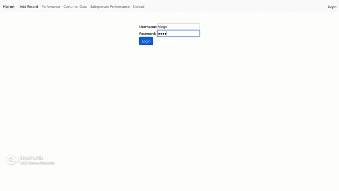

# Intro

The project was based on the tutorial by [Pyplane](https://www.youtube.com/watch?v=bLidW4iByqo). The main goals were to create a website using data science packages, such as pandas, seaborn, and matplotlib.

One interesting discovery I made was that matplotlib has a backend system, which I found intriguing.

However, my code differs from Pyplane's approach as I used Bootstrap for HTML instead of Semantic UI. Additionally, I utilized example data created with chat-gpt, which greatly helped me throughout the tutorial, guiding me through various moments and assisting me in resolving any issues I encountered. ^-^

I thoroughly enjoyed working on this project and found it to be a valuable learning experience.

  

